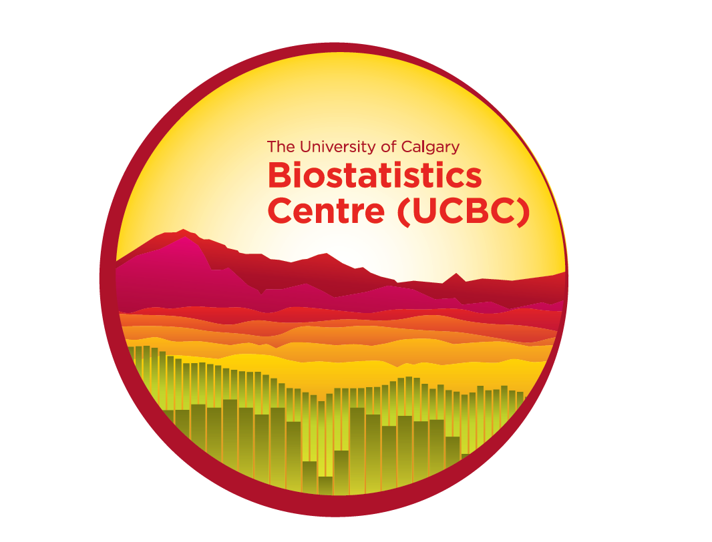

```{r setup, include=FALSE}
options(htmltools.dir.version = FALSE)
```

# Agenda

* Sponsors
* Code of conduct
* Using wonder.me
* Current volunteers
* Call for speakers
* Introductions

---

# Sponsors




---

# R Consortium Code of Conduct

A member of the R Community is:

* Open: Collaboration, receptive to constructive comment and criticism, accepting of anyone who wishes to take part in our activities, fostering an environment where all can participate and everyone can make a difference.

* Considerate: We're thoughtful when addressing the efforts of our peers, as the labor was completed simply for the good of the community. We're attentive, whether in person or online, and we're tactful when approaching differing views.

* Respectful: We're respectful of others, including positions, skills, commitments, efforts, and processes. We're respectful of the volunteer efforts that permeate the R community. When we disagree, we are courteous in raising our issues.

---

# Using wonder.me

1. Add your **selfie** & icebreaker question, so people can find you with similar interests!
2. Click on the map to drag your avatar and join a **circle**
3. You can turn on your webcam and/or mic, and even share your screen with those in your circle.

## Q & A - Sli.do

.center[]

---
# Current leadership group


* Dylan Loader
* Jennifer Lee

---
# Call for speakers

CalgaryR is looking for a voluntary speakers who would like to provide a tutorial, introduce an interesting problem, or build a partnership to work together. Examples include:

* Statistical modeling, data mining, and machine learning techniques
* Big data analysis, management, and data cleaning
* Software engineering, package development, debugging, and interfacing with other languages
* Reproducible research, parallel computing, scientific computing, and operational research
* Visualization methods and communication

Lots of topics available on our CalgaryR wishlist!

---
# Today's speaker

**Exploring Alberta’s Solar Resource through R**

* Abed W Ayyad
* 7 years experience with R, for GIS & cartography applications
* Has lived in 10 cities, and currently in Edmonton

---
Q & A
<iframe src="https://wall.sli.do/event/hco0pyfk?section=8f54ddf8-e558-4ad6-995c-3fe80efe3319" height="90%" width="100%" frameBorder="0" style="min-height: 560px;" title="Slido"></iframe>

---
# Thank you

* Presenter will be in the "Meet the Speaker" area
* For more information or presentation opportunities, please visit https://imstatsbee.github.io/calgaryr/
* Stay tuned for our next meetup