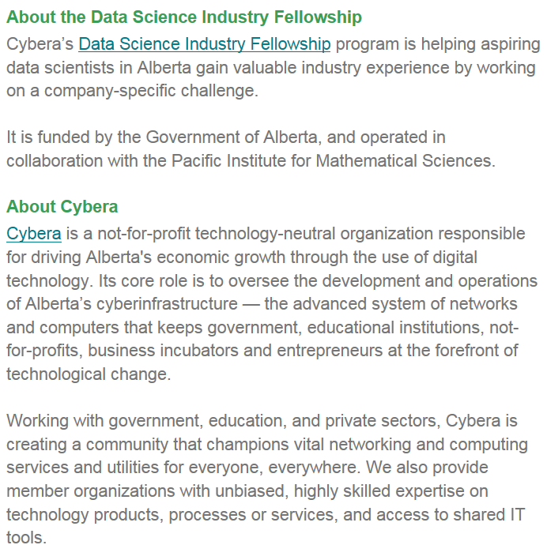

### Fellowship / Training / Tutors  

<!-- 
<embed src="img/BVC_suhayl_20191028_business_intelligence_analyst.pdf" type="application/pdf" width="100%" height="1200px" />
-->

* Cybera's data science fellowship 2019 was completed on August 31, 2019.  The post is no longer available.  

<!-- 
{target="_blank"}
{target="_blank"}
{target="_blank"}
--> 

<!-- 
### **Looking for R Tutors** 

The following individuals are available to be hired as **PRIVATE TUTORS**.   This list is created as a service for the members and the **CalgaryR** group does not take any responsibility for the hiring process.   All arrangements, financial or otherwise, are strictly between the individual who is going to hire and the tutor listed here.   Note also that appearance of tutor's name on this list does not guarantee of the tutor by the group.

* Dayne Sorvisto <<daynesorvisto@yahoo.ca>>
* Kimberly Rondeau <<kim.rondeau@ualberta.ca>>
-->

