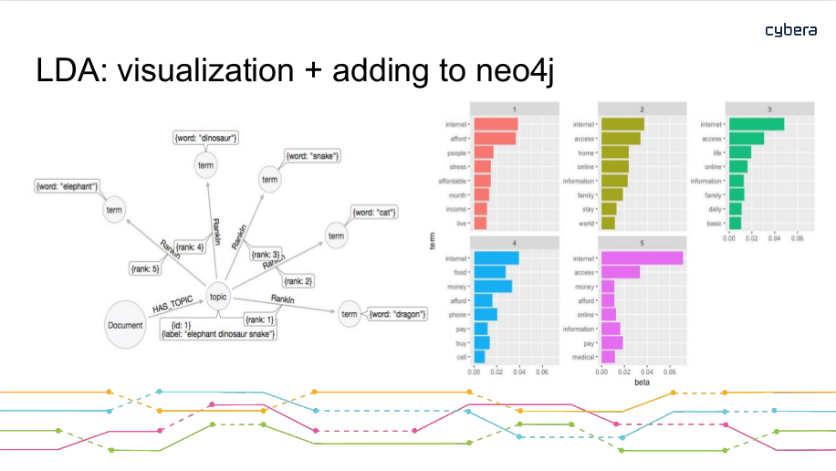
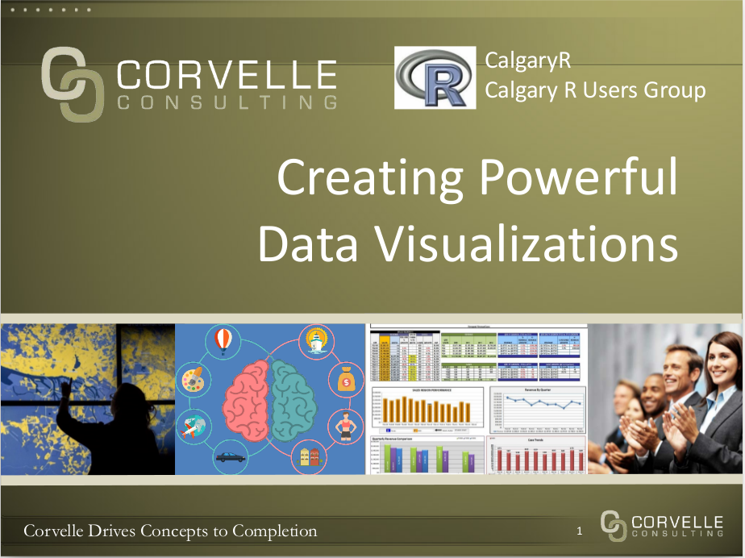

* 2019-APR-17 [**Gas Price Micro Market** / **Air Quality and Cognitive Performance**](https://www.meetup.com/calgaryr/events/259954229/){target="_blank"}

	* **Gas Price Micro Markets**, by Kai Lukowiak
	
	[[**Presentation is now available**](./slides/c1819/20190417_kai_lukowaik.pdf){target="_blank"}]
	
	Gas station prices are highly dependent on competition. Due to the nature of gasoline markets this competition is very local. Industry does not segment markets beyond the city level, potentially leaving profits on the table.  Stations are also able to set their own prices to some extent (without the input from corporate), introducing variability into pricing. I use this variation to try and identify submarkts.  I used python to scrap gasbuddy.com and pandas to clean the time-series data. I then imported the data into R and used the package tsclust to create a hierarchical cluster of the data based on euclidean distance and correlation.  Other methods of clustering were investigated, most interestingly, dynamic time warping and Frechett Distance. These methods were abandoned because of their computationally expensive nature. I did not have the time or budget to set up my analysis on a large AWS cluster.  I then set arbitrary cutoffs for the hierarchical clusters and used this classification as my labels.  With these labels, created a KNN model to cluster the gas stations based on latitude and longitude. I then used a test set to validate the accuracy of my clustering algorithm.  I had very promising results for gas stations that were very close to each other, however, I was unable to identify greater submarkets in a specific city (e.g., the north west of Calgary).  I believe these poor results are due to the transient nature of markets and the poor quality of information gained from scrapping gasbuddy.  Further analysis is needed to investigate how different clustering algorithms would work, along with diffferent hierarchical cutoff methods.
		
	Kai is a passionate cross-country ski racer and runs two learn to ski websites with his mother and a national level coach. He graduated from the University of Calgary with a BA-H in Economics and from City University of New York with a MS in Data Science. He currently works in the retail gasoline sector.  Kai loves solving interesting and challenging problems and dreams of one day entering the healthcare sector.
		
	* **Clouded Thoughts: Air Quality and Cognitive Performance**, by Arthur Novaes de Amorim
	
	[[**Presentation is now available**](./slides/c1819/20190417_arthur_amorim.pdf){target="_blank"}]
	
	This paper investigates the impact of air pollution on the quality of decision-making in tasks demanding a high degree of inductive reasoning. I exploit air pollution shocks in South Korea and Japan induced by natural phenomena called Asian dust storms to quantify the effect of air quality on the cognitive performance of expert players of the strategy board game Go. I develop performance measures in the game with the assistance of Leela Zero - a Go-playing artificial intelligence stronger than any human - as an expert evaluator of moves played by highly skilled humans. For players above 30 years of age, I find that exposure to an Asian dust storm increases the propensity to blunder by approximately 15 percent or, equivalently, 2 game moves. The effect dissipates for younger players, consistent with a well-established literature suggesting an older population is more vulnerable to health effects of air pollution. My finding suggests the heterogeneous effects of air pollution on cognitive performance of individuals potentially affects tournament outcomes and may thus lead to allocative inefficiencies.
	
	Arthur Novaes de Amorim is a PhD student in economics at the University of Calgary with interests at the intersection of environmental and behavioural economics.  His research agenda is empirically-driven and focuses on applying concepts of statistical learning to unanswered questions of economist interest. Before starting his PhD, Arthur worked briefly as a research economist for Natural Resources Canada and extensively as a collaborative pianist and music teacher.

 

* 2019-MAR-20  [**Beating the World's Best in the Santander Bank Customer Value Prediction Competition**](https://www.meetup.com/calgaryr/events/259163330/){target="_blank"}

    [[**Presentation is now available**](./slides/c1819/20190320_alastair_muir.pdf){target="_blank"}]

    Dr. Alastair Muir has been using advanced analytics in management consulting engagements around the world for over fifteen years.
 
    He will show how to make a presentation to the executive on the project, to be followed by how to do the detective work necessary to create high performance, useful, and explainable models for an online banking application. The journey includes R, keras, LIME, and TensorFlow.

    From the Kaggle challenge, "According to Epsilon research, 80% of customers are more likely to do business with you if you provide personalized service. Banking is no exception."
    

 

* 2019-FEB-20 [**Predicting Traffic Collisions in Calgary using Open Data and Machine Learning**](https://www.meetup.com/calgaryr/events/258719485/){target="_blank"}

    [[**Presentation is now available**](./slides/c1819/20190220_saadip_moiuddin.pdf){target="_blank"}]

    Saadiq Mohiuddin will speak about his recent project Predicting Traffic Collisions in Calgary using Open Data and Machine Learning. He'll walk through some exploratory data analysis and how he created the visualization using Tensorflow and Mapbox.
Saadiq Mohiuddin (@saadiqmohiuddin) is a transportation engineer at the City of Calgary with an interest in data visualization, machine learning and deep learning and using technology to better understand mobility in cities. He blogs at http://www.saadiqm.com.
This project has garnered quite a bit of interest and was featured in a CBC article:
https://www.cbc.ca/news/canada/calgary/forecasting-car-crashes-data-map-1.4852286

    As a second speaker of the night Dr. Chel Lee will provide a short tutorial on creating a neural network in R. It will be about 20-30 minutes long and will go through the steps on creating your first neural network and some of the things to be aware of when using them.

 

* 2019-JAN-16  [**Using R, Risk assessment in Oil&Gas and More about measures of association**](https://www.meetup.com/calgaryr/events/257559711/){target="_blank"}

    We have two talks contributed by **Oscar Montoya** (data analyst/computational biologist) and **Thomas Speidel** (data scientists and statistician at Suncor Energy). Please join us for pizza at 6 pm.

    Talk 1. **Using R to assess the risk of microbiologically influenced corrosion in the Oil & Gas industry**, by Oscar Montaya

    Microorganisms can have beneficial or detrimental impacts on a wide range of human activities, from our food and nutrients (outside and inside our bodies) to human-made infrastructure. Among the negative impacts on infrastructure, microbiologically influenced corrosion in upstream and downstream Oil & Gas industry is a very relevant topic, especially for Alberta, given the close relationship that our province has with fossil fuels production. Some microorganisms, referred as sulfate-reducing microorganisms, are capable of using oil organics as a carbon source (cells building-block material) and respire chemical species present in oil/water, leading to the formation of corrosive compounds. When corrosion happens, it can cause oil spills and the interruption of oil and gas production, ultimately translated into billions of dollars in losses and a negative public image for the industry. Using nucleic acid-sequencing technologies and R, it is possible to identify what microorganisms are present in an oil sample and correlate their presence to environmental data (metadata) to generate very informative conclusions for the industry. The results can then be incorporated into the decision-making toolkit by operators as part of corrosion prevention/management in upstream and downstream operations.

    He is a data analyst/computatinoal biologist with a M.Sc. in environmental microbiology from the University of Calgary, and over seven years of experience doing what he likes the most in life: Finding patterns and correlations in complex data sets to answer often intricate questions. A biologist by training, Oscar has over four years of data analytics experience programing in R, with skills that include statistical analysis, advance graphics and report generation. Over the last three years, Oscar has been the sessional lecturer for a graduate-level course on R programing language at the University of Calgary, where he is also doing his Ph.D. on microbiologically influenced corrosion of pipelines. Oscar also has experience with the development of habitat exclusion programs of black vultures (Coragyps atratus) in a landfill, and the use of macroinvertebrates as water quality indicators, and fish characterization.

    Talk 2. **Some Common and Less Common Measures of Correlations and their Implementation in the R Language**, by Thomas Speidel

    Correlation is not causation; but it surely is a sign (Good, Hardin. Common Errors in Statistics and How to Avoid Them. Wiley; fourth edition 2012). Measures of correlation are common in many scientific fields as an exploratory tool used to quantify the strength of association between pairs of variables. The ubiquitous Pearson’s correlation coefficient is the default correlation measure in most analytical packages. However, there are more flexible measures in order to cover the eventuality of outliers, non-linear relationships, the type of quantitative variables, or other nuances in the data. In this talk, we will illustrate some common and less common measures of correlations and their applications in R. Time permitting, we will touch upon correlation in time series data where common measures applied to independent data are not appropriate in the presence of dependent data.

    He is a Canadian statistician and data scientist, working for Suncor Energy. For nearly a decade he has served as an applied cancer Statistician. Passionate about statistical literacy, he has brought his expertise to the Oil and Gas industry helping engineers and other professionals bridge the gap between the data and the information they need. Thomas' expertise are in the area of predictive and explanatory modelling, time to event analysis, reproducibility and visualizations.

 

* 2018-DEC-19  [**R and the Undocumented NHL API**](https://www.meetup.com/calgaryr/events/257043155/){target="_blank"}

    **Brett Wiens** will present on his hobby analysing NHL statistics using the Undocumented NHL Stats API. The NHL has made extraordinary amounts of information available about teams, players, games, and even individual plays. Cleaned and organized, this is an extremely rich source of raw data that can be used for all sorts of analytics.

    Steeped in tradition, the NHL is a lush breeding ground for gut-based decision making, and “because-we’ve-always-done-it-that-way” thinking. Brett has developed a series of scripts, modules, and functions in R that gather, process, clean, and present this information with easy-to-digest visualizations through a Shiny interface. This presentation will touch on the collection of data, how it was cleaned and processed, some learnings made along the way, and ultimately the Shiny application to visualize information.

    Brett Wiens is a graduate of the Masters of Geographic Information Systems program at the University of Calgary and an avid Calgary Flames fan. He is a data scientist in Cenovus Energy’s Innovation and Analytics team.

    **Tolu Sajobi** is a professor in Community Health Epidemiology. He would like to discuss a proposed training program in data analytics. Some potential opportunities for collaboration among academic and industry experts will be discussed.

    **Theresa Smith** is an environmental engineer who went back to school after the 2015 downturn. She graduated from a Masters in Business Analytics in 2017 and has been working at TransAlta for over a year as a data scientist. She has recently started a meetup group Women in Big Data (https://www.meetup.com/Women-in-Big-Data-Calgary/). This group is a chapter of the larger Women in Big Data organization started by some bright minds at IBM in Seattle. The group aims to facilitate the advancement of women in STEM and data science through learning and networking opportunities.
    
 

* 2018-NOV-21  [**Modern machine learning methods in SAGD, PIMS and Energy Datathon Summaries**](https://www.meetup.com/calgaryr/events/255956421/){target="_blank"}

    [[**Presentation is now available**](./slides/c1819/20181121_jamal_bajwa.pdf){target="_blank"}]

    This month we have three talks. The first is an applications of machine learning in SAGD reservoirs. The Second is a summary of the recent Untapped Energy Datathon. We'll close out with a summary from the PIMS datathon.

    **Jamal Bajwa** will present on:  SAGD (Steam-Assisted Gravity Drainage) is a popular recovery method used in reservoirs containing Bitumen. Majority of the in-situ Oil Sands projects in Alberta use SAGD as their primary recovery method. While significant work has been done in the last two decades to improve first-principles modelling of recovery from SAGD-operated reservoirs, little has been done to systematically leverage operating data to inject steam optimally. In this work, we attempt to use modern machine learning methods to create empirical models for oil production as a function of steam injection. The production models serve as an input to an overarching optimization model that recommends optimal steam distribution across a well pad. The model development process is complete and the models are currently being put into production at Nexen's Long Lake facility.
    
    

    **Marc Boulet** will present a summary on:  
    The Untapped Energy datathon where 3 teams chose to address one of these five topics in the oil and gas industry:
    Social license: Are sentiments towards large-scale pipeline projects TO BE BELIEVED? -
    Aging Infrastructure: Finding the factors that contribute to FAILURES and EFFICIENCY of wells, pipelines and facilities.
    Repurposing of Infrastructure: Finding the next life of suspended or abandoned wells - GEOTHERMAL, BABY!
    Health & Safety: Safety data is not a competitive advantage - but safety can support an INDUSTRY ADVANTAGE.
    New Business Models: Markets where data is made public/widely shared outperform markets that don’t - WE'LL PROVE IT!

    **Ben Reeves** and **Cliff Sobchuk** will present a summary on:
    The PIMS datathon created an opportunity for Calgarians to evaluate the available City of Calgary’s Open Data Portal, and discuss ideas to enhance the infrastructure. Results supported how we use water, to improving drop-in sports to online interactive environmental games.
    
 

* 2018-OCT-17  [**Identification and prediction of health-related quality of life trajectories after a prostate cancer diagnosis**](https://www.meetup.com/calgaryr/events/254987928/){target="_blank"}, by Megan Farris, Research Associate at the MEDLIOR Health Outcomes Research Ltd.

    [[**Presentation is now available**](./slides/c1819/20181017_megan_farris.pdf){target="_blank"}]

    RSVP via meetup at https://www.meetup.com/Calgary-R-User-Group/events/254987928/
    
    **Background**: Group-based trajectory models (GBTM) are becoming increasingly popular in health research. In this presentation, GBTM are used to understand health-related quality of life (HRQoL) after prostate cancer diagnosis.
    
    **Objective**: The aim of our study was to identify physical and mental HRQoL trajectories after a prostate cancer diagnosis and systematically characterize trajectories by behaviours and prognostic factors.
    
    **Methods**: Prostate cancer survivors (n=817) diagnosed between 1997 and 2000 were recruited between 2000 and 2002 into a prospective repeated measurements study. Behavioural/prognostic data were collected through in-person interviews and questionnaires. HRQoL was collected at three post-diagnosis time-points, approximately two years apart using the Short Form (SF)-36 validated questionnaire. To identify physical and mental HRQoL trajectories, GBTM was undertaken. Differences between groups were evaluated by assessing influential dropouts (mortality/poor health), behavioural/prognostic factors at diagnosis or during the follow-up.
    
    **Results**: Three trajectories of physical HRQoL were identified including: average-maintaining HRQoL (32.2%), low-declining HRQoL (40.5%) and very low-maintaining HRQoL (27.3%). In addition, three trajectories for mental HRQoL were identified: average-increasing HRQoL (66.5%), above average-declining HRQoL (19.7%) and low-increasing HRQoL (13.8%). In both physical and mental HRQoL, dropout from mortality/poor health differed between trajectories, thus confirming HRQoL and mortality were related. Furthermore, increased Charlson comorbidity index score was consistently associated with physical and mental HRQoL group membership relative to average maintaining groups, while behaviours such as time-varying physical activity was associated with physical HRQoL trajectories but not mental HRQoL trajectories.
    
    **Conclusion**: It was possible to define three trajectories of physical and mental HRQoL after prostate cancer. These data provide insights regarding means for identifying subgroups of prostate cancer survivors with lower or declining HRQoL after diagnosis whom could be targeted for interventions aimed at improving HRQoL.

    

 

* 2018-SEP-19  [**Spatial-Temporal Gaussian Processes for Wind Power Generation**](https://www.meetup.com/calgaryr/events/254176561/){}, by Yilan Luo, MSc Candidate, Mathematics and Statistics, University of Calgary

    [[**Presentation is now available**](./slides/c1819/20190919_yilan_luo.pdf){target="_blank"}]

    Wind is one of renewable and green energy sources contributing to Alberta's energy program and economics. We are interested in the spatio-temporal feature of wind power generation. Gasussian process is utilized to model this feature. 
    
    Covariance function is an important characteristic of a spatio-temporal process, since it describes the association of random variables in space and time. We studied various covariance function models (separable, non-separable symmetric, and non-symmetric) by following Gneiting et al. (2006) and measured how good they are by comparison. 
    
    A simple Kriging technique is used to demonstrate the performance of models when forecasting the future wind generation for both an existing wind farm and a new farm. RMSE and MAE are used to measure the accuracy of prediction. Finally, we are sharing our experiences on the choice of best practical scenario of new wind farms based on the aggregate wind power generation.
    

 

* 2018-May-23 [**Probabilistic topic modeling and Natural Language Processing**](https://www.meetup.com/Calgary-R-User-Group/events/250461813/){target="_blank"}, by Mark Barley, Menome Techonologies Inc. 

Mark will be presenting on the use of probabilistic topic modeling and natural language processing in relation to the graph database neo4j. Menome Technologies Inc. is a Calgary Alberta Canada based organization whose mission is to help organizations fully realize the value of their data. Mark is a Calgary native interested in information theory and organizational science. After graduating from Western Canada High School in 2012 he went on to study Computer Science and Philosophy at the University of Calgary, graduating with a specialization in Multi Agent Systems. Mark has been a core contributor to Menome's platform and philosophy since starting with us in May 2017.
Mark will lead us through an introduction to their process with some of the applied use-cases they have in production to represent a model in a graph database, and classifying new textual documents against that model to extract defining characteristics of that documents contents.

Article classifier

File harvester->File classifier

Graph operations post-processing of files

Mark will then give a demonstration using an open data source to provide some applied context from their corporate work to illustrate how topic modeling is used in real world use cases.

 

* 2018-APR-25 [**We use both SAS and R**](https://www.meetup.com/Calgary-R-User-Group/events/249121911/){target="_blank"}

1. **Creating an Open Analytics Ecosystem**, by Matthew Joyce, System Engineer, SAS

He will discuss the importance of building a scalable and open analytics platform within an organization. Organizations are often challenged today by the variety of languages and applications to choose from and need to easily deploy models into production. I will discuss how to leverage the power of open source by giving you the ability to able to create models in multiple languages, and executing those models on a single enterprise platform.

2. **Professional Data Analysis with R, SAS, Python and Beyond**, Dayne Sorvisto, Inegration Consultant

This talk will primarily be an introduction to SAS programming for R users. The focus of the talk will be on using SAS in the workplace and writing professional code. The goal of the first half of the talk is to show how common data manipulation and modeling tasks can be accomplished in different ways in both R and SAS. The trade-offs of each language will be discussed with reference to real-world business problems. In the second half of the talk, Dayne will share some personal experiences using other popular alternatives to R like Python. The talk will finish with a fun demo using his favorite machine learning library TensorFlow.

 

* 2018-APR-11 [**Data Analytics in Sports & Entertainment**](https://www.meetup.com/Calgary-R-User-Group/events/246555479/){target="_blank"}, by Vince Ircandia, Founder and CEO of StellarAlgo

vince will be on-hand to discuss both the business and technical aspects of his Calgary-based company, which enables organizations to build cohesive, transparent and sophisticated cultures anchored in data-based decision-making. StellarAlgo's clients include a number of professional sports teams, including the Calgary Flames, Vancouver Canucks, Portland Trail Blazers and LA Galaxy, as well as Seattle's Museum of Pop Culture.

 

* 2018-MAR-28 [**How many words did William Shakespeare know? Really? **](https://www.meetup.com/Calgary-R-User-Group/events/245398867/){target="_blank"}, by Chel Hee Lee, Postdoc, Mathematics and Statistics, UCalgary 

He will focus on the practical aspects of R programming when developing a package. For the purpose of illustration, the problem of estimating the unknown size (such as the number of words William Shakespeare know or the number of households during the outbreak of cholera) is going to be mainly discussed. The participants have an opportunity to learn the following basics:

1) a concept of estimating equation that cannot be solved by hand,
2) several numerical techniques to solve that equation,
3) error-handling when writing a user-defined function, and
4) methods for objective-oriented programming

This workshop will take you to the next stage of R programming for your work. If time is permitted, we will see another example of Bayesian linear regression.

 

* 2018-MAR-14 [**The Essentials of Text-Mining and Sentiment Analysis**](https://www.meetup.com/Calgary-R-User-Group/events/248099457/){target="_blank"}, by Tatiana Meleshko and Alex Tennant, Data Scientists at [Cybera] (https://www.cybera.ca/){target="_blank"}

As an introduction to text-mining and sentiment analysis we will outline our trials, tribulations and workflow experienced during our analysis of 65,000 pages of documents submitted to the CRTC as part of its Basic Service Objective consultation in 2015. These documents contained a variety of questions and answers from a number of invested parties, ranging from personal letters to official responses from various telecom service providers, from which we hoped to extract useful information. Faced with a variety of document types and unpredictable formats, we approached the analysis with a variety of tools to sort and process the documents.

We shall outline our use of the neo4j graph database in order categorize each document and visualize the relationships between them. We will describe the use of "fuzzy" text searches with solr as well as more more abstract searches using gensim's doc2vec to locate and extract elements of text relevant to the questions we set out to answer. After we have outlined our process of text extraction, we discuss our approach using sentiment, N-gram, text2vec word filters, LDA topic analysis, and what can be learned from the visualization of the hidden relationships between words. Finally, we will present the resulting tool we made available for anyone to browse and explore the documents submitted to the consultation on their own. This introductory talk will provide you with a basic understanding of text-mining which will aid you in your own document processing expeditions.

 

* 2018-FEB-28 [**Understanding Computer Vision**](https://www.meetup.com/Calgary-R-User-Group/events/247390933/){target="_blank"}, bu Calvenn Tsuu, Founder of Talented Component Co. Ltd 

He will increase our understanding of how to connect computer with powerful vision. The first hour will show us how the computer sees the world. Then we can think and talk about what we can do about those pixels. Calvenn will describe these aspects of powerful vision tools:

* Understand pixels and lens
* Calibrating the Camera
* Basic transforms
* Present and practice use of OpenCV

These techniques for OpenCV is based on Python and Jupyter Notebook. Learning Objectives from this talk are:

* Understand design considerations on OpenCV
* Understand effective techniques to create visualizations
* Understand best practice tips for OpenCV

 

* 2018-JAN-31 [**Creating Powerful Visualizations**](https://www.meetup.com/Calgary-R-User-Group/events/245364402/){target="_blank"}, by Yogi Schulz, Founder of Corvelle Consulting

Yogi Schulz will increase our understanding of how to create powerful visualizations. We've all sat through unreadable, confusing, boring, or even misleading presentations with their associated charts. We'll talk about how to make charts more powerful so that we communicate our message better.

Yogi will describe these aspects of powerful visualizations:
1. Understand visualizations
2. Create visualizations
3. Refine visualizations
4. Present and practice visualizations

These techniques for powerful visualizations apply regardless of which of your favorite software tools you are using.

Learning Objectives:

1. Understand design considerations that lead to powerful visualizations
2. Understand effective techniques to create visualizations
3. Understand best practice tips for presenting visualizations

Biography: He founded Corvelle Consulting. The firm specializes in project management and information technology related management consulting in the upstream oil & gas industry.

 
* 2018-JAN-17 [**Interactive session to identify talks**](https://www.meetup.com/Calgary-R-User-Group/events/245364518/){target="_blank"}, by Cliff Sobchuk 

This is your day to provide input in to direction of the Calgary R users group meetup.

It will be a day of participation and involvement from everyone. We will have flip chart paper on each of the tables that will be used to write down topics of interest from everyone. The goal is to get direct input from the group on the specific areas in which people are interested. This will be done during the first 20 to 30 minutes of the meeting depending on how many ideas we are able to gather.

The next part of the meeting will be to silently vote on your top three by using stickers to identify your topics of interest. We will then take those topics and determine the top ones that we can address this year. If there are a number of topics that are of similar counts, we may require a tie breaker round.

 

