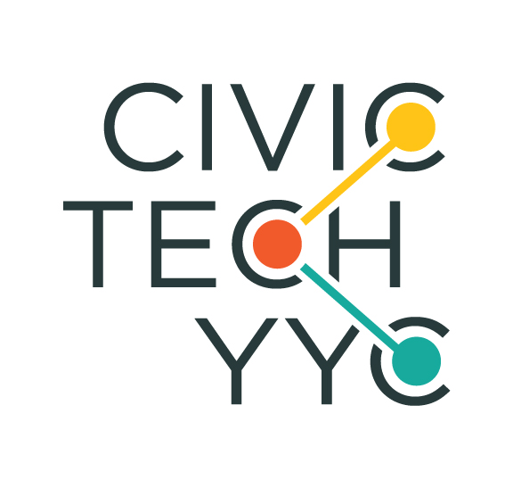
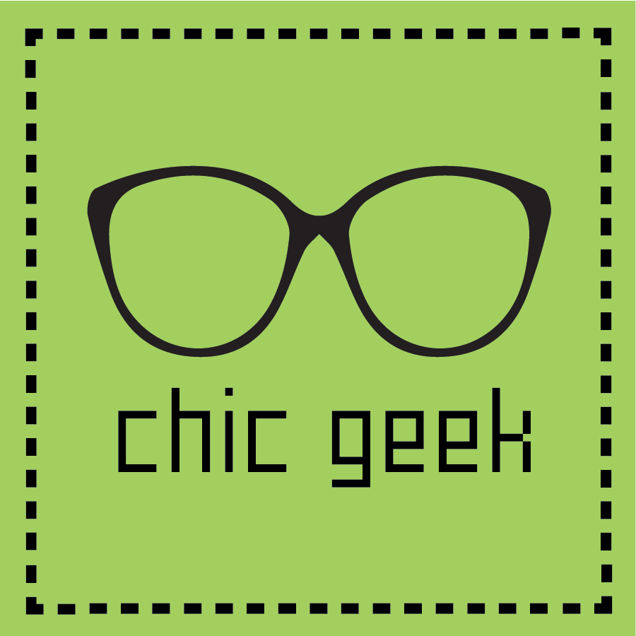

<!-- https://www.pims.math.ca/industrial-event/180623-cpd -->

 

<table>
<tr>
<td> <a href="#objectives">**Objectives**</a> &nbsp;&nbsp; | &nbsp;&nbsp; </td>
<td> <a href="#theme">**Theme**</a> &nbsp;&nbsp; | &nbsp;&nbsp; </td>
<td> <a href="#outcome">**Outcomes**</a> &nbsp;&nbsp; | &nbsp;&nbsp; </td>
<td> <a href="#agenda">**Agenda**</a> &nbsp;&nbsp; | &nbsp;&nbsp; </td>
<td> <a href="#registration">**Registration**</a> &nbsp;&nbsp; | &nbsp;&nbsp; </td>
<td> <a href="#sponsors">**Sponsors & Contributors**</a> </td>
</tr>
</table>

 

<a href="#outcome">Presentation files are available (2018-JUN-28)</a>

<a href="#agenda">Agenda is now available! (2018-JUN-15)</a>

 

### <a id="objectives">**Objectives**</a>

[**The 2018 Calgary PIMS Datathon**](https://www.pims.math.ca/industrial-event/180623-cpd){target="_blank"} is a project led by the data-driven communities of Calgary.  Our city is made up of hundreds of communities like ours, and we believe it is the responsibility of these communities to contribute to the city's overall success.  This datathon will create an opportunity for Calgarians to evaluate the available open (mainly found by [the City of Calgary's Open Data Portal](https://data.calgary.ca/){target="_blank"}), and discuss ideas to enhance the infrastructure.  Such enhancements can include, but are not limited to, **improving data connectivity, suggesting the collection of new and relevant data points, and optimizing data usability**.

 

### <a id="theme">**Theme**</a>

We are interested in building a **healthy**, **green**, and **safe** city.   You are free to make your own proposal on various topics as listed in the below:

* Health:  health and wellness, sports and recreation, education, etc.
* Green:  environment, tourism & parks, etc. 
* Safe: police, families and children, law and justices, road, driving, and transport, and safety and emergency services, etc. 

You are also encouraged to utilize the topics listed on the following sources:

* [Mayor's Office Special Projects](http://www.calgary.ca/CityCouncil/Pages/Mayor/Mayor.aspx){target="_blank"}
* [Citizen Dashboard (The City of Calgary's Performance Portal)](http://www.calgary.ca/General/Pages/CitizenDashboard/Citizen-Dashboard-Landing.aspx){target="_blank"}
* [The Engage Section in the City of Calgary](https://engage.calgary.ca/){target="_blank"}
* [Corporate Analytics & Innovation](http://www.calgary.ca/CS/IIS/Pages/home.aspx){target="_blank"}

The rule that you should keep is only to utilize at least one dataset from the [Calgary Open City](https://data.calgary.ca/){target="_blank"}.  Any kinds of accessible data can be incorporated if data used do not violate law, privacy, and intellectual properties.  A variety of resources about the city collected for research purpose is available from the [Research and data about Calgary](http://www.calgary.ca/CSPS/CNS/Pages/Research-and-strategy/Research-and-Resources.aspx){target="_blank"}.   

 

#### **Guideline**

Participants will be asked to develop and present a 10 minute presentation that contributes to one of the topics listed in the theme.

* A assocication map of the open source datasets aligned to their topic of choice.  This map will help us see a potential connectivity between existing data sets and establish the standards for data sets which are newly developed.

* A report including relevant analyses for the city to explore

* Suggestions for improving the quality of the data required for the analysis.  For the case where data sets are not available, you may propose some methods or tools for data collection.

 

#### **Example**

The following case study gives a blueprint for how a participant will work during this event.  Assume that you are a participant who is interested in the issue of security within the community, ex. Banff Trail, where you are currently living in Calgary.  

1. You believe that your community has a high rate of breaking and enter when comparing it to other communities.  You are hence looking for some way to decrease this specific crime rate.  You have a theory that surveillance cameras, which are not installed in either location, maybe key to reducing break and enter crimes. 

2. To address your idea, you start by searching for data about community crime rates.  You find that the information that you want to use can be found from the [Calgary Police Crime Statistics](https://data.calgary.ca/Health-and-Safety/Community-Crime-Statistics/848s-4m4z){target="_blank"} data set which is provided by the City of Calgary.  

3. You generate a crime map using Calgary community demographics and community boundaries which are also provided by the City of Calgary open data.  Now, you look for evidence to support your idea about surveillance cameras. 

4. Even if your idea is not be supported by evidence, you can still address your thought.  If the number of surveillance camera in your community is few or they are not well located for break and enter purposes.  Hence, you now look for data that might support it. Unfortunately, you could not find any data that can be used to address your idea.  In this case, you start writing a proposal with the reasons why such data are needed and what data is required to be collected.   Subsequently, you suggest an analytical approach using this data to provide support for the thesis that surveillance cameras reduce break and enter crime. 

5. You still question the surveillance dead zone areas although the required data for your purpose is not available.   You believe that traffic cameras may play such a role.  Hence, you search for information about traffic camera locations.   Using the point of view information from each camera, you make a bubble plot on the community map to show the traffic camera coverage which could be used for surveillance.  You achieved the goals of event perfectly. 

 

### <a id="outcome">**Outcomes**</a>

  

#### **Presented Works on Day 2**

Thank you for sharing your work with us here.  Note that only presentations that a sharing permission is obtained are listed here. 

 
**Rain and Snow Harvesting for Plant Irrigation in YYC**, by [Samuel Lu](samuelbolu@gmail.com), [Shophia Lu](sophialu321@gmail.com), [Monireh Rezai Rab](mrezaira@ucalgary.ca), [Alex Zhang](alex1212ok@gmail.com), [Jing Zhong](jingjing5201988@hotmail.com), [Wenyan Zhong](zwenyan0616@GMAIL.COM)

See the [**Presentation**](./pims2018/pims_datathon_2018_rain_and_snow_harvesting_for_plant_irrigation_in_yyc.pdf){target="_blank"} (uploaded on 2018-JUN-28)

In Calgary, we rarely have to consider the consequences associated with water usage since it is an abundant and easily accessible natural resource within much of our country. However, it is necessary to bring to light the issue of clean water shortages due to excessive consumption. Upon analyzing the data present on Open Calgary, we observed that a significant proportion of water is spent on domestic and city wide irrigation. We explored one method in which excessive water usage can be reduced through our proposal of rain and snow harvesting for plant irrigation. Seeing that the City of Calgary has previously introduced mandatory garbage bins, recycling bins, and most recently, compost bins, which were all very effective, we decided to approach this issue in a similar manner. Our analysis shows that the peak of the demand for water coincides with the peak of precipitation in Calgary which occurs in spring/summer. By implementing the use of domestic rain barrels for each household, the expected outcome is that Calgarians would collect precipitation during the winter and spring seasons for use in the summer, thereby reducing the use of clean water on lawns. Further, this project envisions the future potential for the City of Calgary to introduce public precipitation collecting resources, thus also reducing the cost of water used on public irrigation projects. 

 
**The Paths We Walk** , by [Karly Ross](k.j.ross100@gmail.com), [Cyrus Towfighi](cyrus.towfigihi@gmail.com), [Ed]()

See the [**Presentation**](./pims2018/pims_datathon_2018_the_paths_we_walk.pdf){target="_blank"} (uploaded on 2018-JUN-28)

The need to create effective tools for pedestrians to understand walking in their local context is outlined in the City of Calgary pedestrian strategy. Given the current trend of automating mapping and route-finding a component of creating walkability is create good automation for maps and route finding for the pedestrian the context. Maps like all models are good models with reasonable fit to reality when the parameters we use to define them are consistent with the systems they are modeling. From observations of the team, there is a distinction between the mental processes used when people map walking routes and when people map driving routes, thus using the same parameter inputs into both mapping and we hypothesize that route finding decreases in efficiency for automated mapping and designation of walking routes.  The core hypotheses of the group is that if we find the right parameters the value and quality of the routes and the maps for pedestrians in the city of Calgary context will improve.  We discussed strategies for determining pedestrian models and clarification on the mapping will require a literature search for information or a full-scale research project. To explore how to produce a test case our group filtered through the City of Calgary data sets to determine which data sets we could use given out hypothesis about mapping for pedestrians and which ones we would need. A selection of slides from our presentation are included below. 

 
**Get active with open data!**, by [Ben Reeves](breeves997@gmail.com), [Braedyn Au](braedyn.au@ucalgary.ca), [Chenxi Zhao](chenxizhao2008@gmail.com), [Lina Khatib](linakhatibster@gmail.com), [Russ Brown](russ@mikatahealth.com), [Adam Benaceur](benaceur.adam@gmail.com)

See the [**Presentation**](./pims2018/pims_datathon_2018_get_active_with_open_data.pdf){target="_blank"} (uploaded on 2018-JUN-28)

Physical recreation is a thoroughly researched method shown to increase all aspects of health, cardiovascular, sleeping, mental, etc. However, despite the proven benefits, many adults do not meet the amount recommended not only by Alberta Health Services, but also the international scientific community. At the 2018 PIMS Datathon, we met fellow Calgarians which revealed that some of the major obstacles in participating in physical recreation, particularly of social nature such as team sports, was the difficulty of finding a place and people to play with. Examples included people who recently moved to Calgary and therefore do not know where the turf fields, baseball diamonds, or hockey rinks, etc. scattered around the city are, mothers who found it difficult to look through a multitude of resources just to enroll their children into a sports league, and others who just wanted to play an organized game but do not have enough players. To help solve this issue, the open data from the City of Calgary reveals geo-maps of all the recreational facilities and open sports grounds maintained by the City with metadata included. By taking this data and implementing it into our own platform, Calgarians can find nearby places to play all their favourite sports. To improve the social aspect, our platform also features live events and facility specific websites and information so not only will people know where they can play, but also when. By making Calgary’s facilities more accessible, we hope to promote a healthier lifestyle in our City. 

 

**Safety and Redevelopment**, by [Alexander Havers](mailto:alexander.havers@ucalgary.ca), [Andrey Sivyakov](mailto:andrey.sivyakov@ucalgary.ca), [Keenan Viney](mailto:vineyk@hotmail.com), [Michael Chui](mailto:mikel.k.khui@gmail.com)

See the [**Presentation**](./pims2018/pims_datathon_2018_safety_and_redevelopment.pdf){target="_blank"} (uploaded on 2018-JUN-28)

Our team chose to look at how transit changes crime in the surrounding area. We felt this question was pertinent for two reasons. First, there is often significant opposition to new transit projects like the Green line and South West BRT based on fears that area crime will increase due to the new transit connection. Second, although there is a literature that generally finds transit increases crimes of opportunity, there was nothing found that would generalize well to the Calgary experience. The first thing we looked at was, the communities adjacent to C-train stations had higher crime rates. On average, adjacency to a C-train station was associated with a crime rate that was more than a third higher than other communities, and this difference was largely driven by an increase in the number of social disorder type crimes. The limitation in this analysis is that there is no suggestion about which way causality is running and also, given how long many of these stations have existed; it would be difficult to make recommendation to new station builds. For a more relevant insight, our team decided to employ a difference-in-difference analysis on the crime rates associated with the opening of the Tuscany C-train station. Our results show that there is an increase in crime as a result of a C-train station opening, the effect is relatively small, and in contrast to our earlier finding, the type of crime that increases most is theft from vehicles. We believe these results suggest a way forward for opening new C-train stations. Mitigations should be focused on the crime types that are caused by a station opening. These mitigations could include the design of the parking areas near new stations, educating the surrounding community about how they can make themselves less vulnerable to thefts from their vehicles, and tailored enforcement efforts based on the applicable crime types.

 

**Pedestrian Safety**, by [Asim Kaghzi](mailto:akaghzi@gmail.com)

See the [**Presentation**](./pims2018/pims_datathon_2018_pedestrian_safety.pdf){target="_blank"} (uploaded on 2018-JUN-28)

No abstract is provided. 

 

### <a id="agenda">**Agenda**</a>

 

#### **June 23, 2018 Saturday**

**08:30** Registration confirmation 

<u>**Wi-fi**</u> Choose **airuc-guest**

<u>**Breakfast (Continental)**</u>

Assorted Danishes, Mini Butter Croissant and Individual Assorted Yogurt
with Fresh Sliced Fruit served with House Made Berry Jam, Butter and
Preserves. Includes Pitchers of Orange and Apple Juice, Fair Trade Coffee
and Tega Tea.

**9:10** Opening speech by Christian Rios & Acknowledgement for participation

**9:15** Invited Session I: <b><u>*Design Thinking and Doing: Hackathon Edition*</u></b> by Gabrielle Dickson from Gabrielle Dickson*

**9:45** Invited Session II: <b><u>*City of Calgary Open Data: Past, Present, Future and How you can be involved*</u></b>, by Nichole Wyatt and Dale McNamee from the City of Calgary 

**10:15** Competition Guideline 

**10:30** Competition Start!

**12:00** Final call for team registration

<u>**Lunch (Taj Mahal Buffet)**</u>

Butter Chicken or Chana Masala served with Basmati Rice, Warm Naan and Assorted House Baked Cookies. Includes Ice Water. **Butter Chicken**

**2:30**  Refresher (**Popcorn Trio**) - Caramel, Cheddar and Buttered Popcorn. Includes Fair Trade Coffee, Tega Tea and Ice Water.

**5:00** The G24 is closed and open 8:00 AM on Sunday

 

#### **June 24, 2018 Sunday**

**8:30** <u>**Dino Breakfast**</u>

Your choice of Buttermilk Pancakes or Belgium Waffles with Butter and Syrup served with Scrambled Eggs, Bacon or Sausage Links and Cubed Hash Browns. Includes Pitchers of Orange and Apple Juice, Fair Trade Coffee and Tega Tea.
Belgium Waffles, Bacon and coffee

**12:00** <u>**Lunch**</u>

Between Bread Package Your Selection of Deli-Style Sandwiches, one Sandwich per person.  

Includes: Fair Trade Coffee, Tega Tea, Assorted Canned Beverages, Fresh House Baked Cookies, Signature Kettle Chips with Sriracha Dip and your choice of Side. 

* Egg Salad Croissant - (Between Breads Sandwich Selection)

* Chef's Selection of Sandwiches and Wraps - (Between Breads Sandwich Selection)

* Roast Beef and Caramelized Onion on a Pretzel Roll - (Between Breads Sandwich Selection)

* Quinoa Kale and Sweet Potato Salad - (Between Bread Side Choice)

**2:00** Final Call for Team Submission 

**2:15** Team  Presentation & Voting Begins

**4:45** Winner Announcement and closing ceremony

**5:00** Closing the event

 

##### Invited Session 1.  <b><u>*Design Thinking and Doing: Hackathon Edition*</u></b>

<b>*Gabrielle Dickson, Information designer, Gabrielle Dickson*</b>

During this presentation, the application of the design thinking process in a hackathon setting will be discussed. Its applications in both guiding the project and facilitating collaboration between team members will be explored. The design thinking process will be broken down into three main phases: inspiration, ideation, and implementation. Each phase will be explained and related exercises and techniques participants may use during the hackathon will be shared. This will equip participants with a process and structure that they may work through during the hackathon.

The format and techniques for preparing a design style presentation will also be shared. This will help participants to efficiently create effective presentations for their hackathon projects.

This presentation will be structured as a mini workshop. Small activities will be included throughout to help participants understand, and engage with, the topic.
 
 

#### Invited Session 2 <b><u>*City of Calgary Open Data: Past, Present, Future and How you can be involved*</u></b>

<b>*Nichole Wyatt, Intellectual Property Analyst, Innovation, Data & External Access, Corportate Analytics & Innovation, City of Calgary*</b>

<b>*Dale McNamee, Lead of the Open Data Program, City of Calgary*</b>

The City of Calgary uses the Open Data Portal to increase public access to data and transparency in government.  By enabling open access to data, the City supports innovation and reuse by the wider Calgary community for knowledge generation and economic development.  The Portal hosts free of charge data sets, downloadable in multiple file formats from various City business units and departments. The Open Data portal offers visualizations, mapping capabilities and opportunities for community engagement to advance and continuously improve the lives of all. 

City of Calgary representative will cover the history and current state of open data at the City and provide a brief overview of data visualizations and other functions of the portal, including how to engage with the Open Data team to collaborate and suggest new data sets.

 

### <a id="registration">**Registration**</a>

You are eligible to join this datathon if you are living in Calgary.   **Participants are encouraged to explore and develop ideas as soon as making a registration (prior to the event)** There is no cost for registration.  What we need is just you.  Please read the **rules**, **schedule**, and **frequently asked questions** to learn more.  

<b>[REGISTER](https://www.eventbrite.ca/e/2018-calgary-pims-datathon-tickets-46478153408){target="_blank"}</b> (Closed on June 22, 2018)

<!-- The online registration form is now available. -->

 

### <a id="sponsors">**Thank You To All Contributors**</a>

Many thanks to our volunteers, executive committee, supporters and sponsors.   Without incredible amount of time and effort, this event cannot be held. 

 

### **Volunteers**

* [Xiaobo Pan](mailto:xlu@ucalgary.ca)
* [Ning Zhang](mailto:xlu@ucalgary.ca)
* [Derek Yip](https://www.linkedin.com/in/dkyip/){taget="_blank"}
* [Alice Lam](https://www.linkedin.com/in/alice-lam-71796238/){target="_blank"}
* [Rebecca Shupe](https://www.linkedin.com/in/rebecca-shupe-379b1312/){target="_blank"}
* [Lourdes Pelayo](https://www.linkedin.com/in/lourdespelayo/){target="_blank"}
* [Sonbol Yazdanbakhsh](https://www.linkedin.com/in/sonbol-yazdanbakhsh-ph-d-99502735/){target="_blank"}
* [Andrea Soo](https://www.linkedin.com/in/andrea-soo-197b0964/){target="_blank"}

 

### **Executive Committee**

* [Cliff Sobchuk](https://www.linkedin.com/in/cliff-sobchuk/){target="_blank"} from [CalgaryR](https://www.meetup.com/Calgary-R-User-Group/){target="_blank"}
* [Chloe Smith](https://www.linkedin.com/in/chloe-smith-46862353/){target="_blank"} from [Analytics Calgary](https://www.meetup.com/Analytics-Calgary){target="_blank"}
* [Drew Gilson](https://www.linkedin.com/in/drewgillson/){target="_blank"} from [Calgary Artificial Intelligence](https://www.meetup.com/meetup-group-wmHrkGoA){target="_blank"}
* [Emma Liu](https://www.linkedin.com/in/emma-yizhou-liu-7a8b3242/){target="_blank"} from [PyData](https://www.meetup.com/PyData-Calgary/){target="_blank"}
* [Geoff Zakaib](https://www.linkedin.com/in/geoff-zakaib-p-eng-mba-b5447a2/){target="_blank"} from [Civic Tech YYC](https://twitter.com/hashtag/CivicTechYYC?src=hash){target="_blank"}

 

### **Chair and Chief Organizers**

* [Cristian Rios](http://math.ucalgary.ca/math_unitis/profiles/cristian-rios){target="_blank"}, Department of Mathematics and Statistics, University of Calgary
* [Chel Hee Lee](https://www.linkedin.com/in/gnustats/){target="_blank"}, Department of Mathematics and Statistics, University of Calgary
* [Chloe Smith](https://www.linkedin.com/in/chloe-smith-46862353/){target="_blank"}, Analytics Calgary

 

### **Sponsors and Supporters**
#### **Platinum** 

 
[{width=300px}](https://www.pims.math.ca/){target="_blank"} 

 

#### **Gold**

 
[{width=300px}](http://schulich.ucalgary.ca/){target="_blank"}

[{width=200px} 
<b>Mathematics and Statistics</b>](http://math.ucalgary.ca/){target="_blank"}

 

#### **Supporters**

[{width=300px}](https://gabrielledickson.myportfolio.com/projects){target="_blank"}
&nbsp; &nbsp;  &nbsp; &nbsp; &nbsp;  &nbsp; 
[{width=250px}](https://twitter.com/dataforgoodyyc?lang=en){target="_blank"}
&nbsp; &nbsp;  &nbsp; &nbsp; &nbsp;  &nbsp; 
[{width=250px}](http://www.opencalgary.org/){target="_blank"}

 
[{width=250px}](){target="_blank"}
&nbsp; &nbsp;  &nbsp; &nbsp; &nbsp;  &nbsp; 
[{width=200px}](https://www.kommunitykonsulting.ca/){target="_blank"}
&nbsp; &nbsp;  &nbsp; &nbsp; &nbsp;  &nbsp; 
[{width=200px}](https://www.thechicgeek.ca/){target="_blank"}

 

